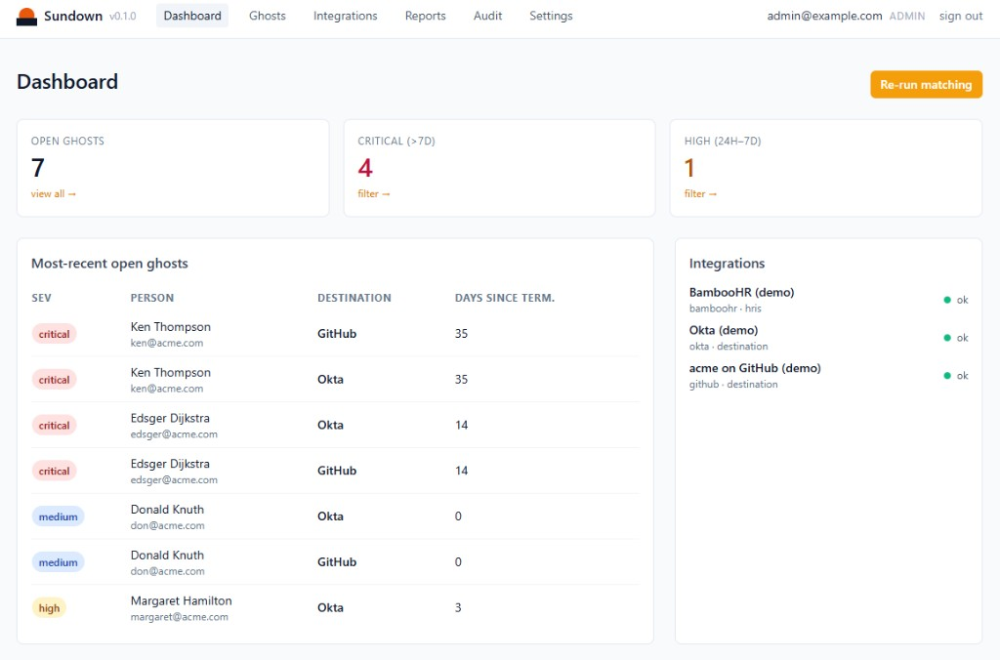

<div align="center">

# Sundown

**Make sure the sun sets on every account.**

Sundown is a read-only auditing tool that detects **ghost accounts** —
accounts in identity providers and SaaS apps that belong to people
who have already been terminated in your HR system.

[](https://github.com/sundown-sh/sundown/actions/workflows/ci.yml)
[](LICENSE)
[](https://www.python.org/downloads/)

<br />



</div>

---

## Why Sundown

Every offboarding process leaks. People leave, tickets get closed, and three
months later there's still a Slack workspace, a GitHub seat, and an Okta
account active for someone who hasn't worked at your company since spring.

Auditors call these **ghost accounts**. They are the single most common
SOC 2 / ISO 27001 finding, and the single most common way breaches start.

Sundown finds them. That's it. **Sundown never touches your systems** — it
reads from your HRIS, reads from your SaaS apps, cross-references the two,
and produces a clean, auditor-ready report you can hand to your CISO.

> **Read-only by design.** Sundown has no write scopes, no API tokens with
> mutation rights, and no remediation actions. Zero blast radius.

## What it does

- Pulls the canonical list of **terminated employees** from your HRIS
  (BambooHR, Rippling).
- Pulls the list of **active accounts** from every connected destination
  (Okta, Google Workspace, GitHub, Slack).
- Matches them with an explainable rule chain (email → alias → SSO
  subject → fuzzy name+domain).
- Produces a **Ghost Report** with severity, last-login data, and the
  exact rule that matched — exportable as JSON, CSV, or printable PDF.
- Posts daily digests + realtime alerts to Slack and signed webhooks.

## What it does *not* do

- ❌ Disable, delete, or modify accounts in any connected system
- ❌ Require write scopes on any OAuth grant
- ❌ Phone home — no telemetry, no cloud dependency
- ❌ Need a Kubernetes cluster or a 12-service compose file

## Quickstart — first ghost in 5 minutes

```bash
git clone https://github.com/sundown-sh/sundown.git
cd sundown
cp .env.example .env
# edit .env, at minimum set SUNDOWN_SECRET_KEY and SUNDOWN_BOOTSTRAP_ADMIN_PASSWORD
docker compose up -d
```

Open <http://localhost:8000> (the server logs `0.0.0.0` because that's its
bind address — your browser still needs `localhost` or `127.0.0.1`), log in
with the bootstrap admin you set in `.env`, and walk through the setup wizard:

1. Connect your HRIS (BambooHR API key, or Rippling OAuth)
2. Connect one destination (Okta is fastest)
3. Click **Run scan**
4. Watch ghosts appear

That's it. No SaaS account, no credit card, no telemetry.

### Even faster: try it on the demo data

```bash
docker compose run --rm sundown python -m scripts.seed
docker compose up -d
```

The seed script populates the database with a realistic fake org so you
can see every severity tier and exercise the full UI before connecting
anything real.

## Architecture

```
┌─────────────┐                       ┌──────────────────────────┐
│  HRIS       │                       │       Sundown            │
│  (BambooHR  │ ──── terminated ───►  │  ┌────────────────────┐  │
│   Rippling) │                       │  │ matching engine    │  │
└─────────────┘                       │  │ (rule chain)       │  │
                                      │  └────────────────────┘  │
┌─────────────┐                       │  ┌────────────────────┐  │
│ Destinations│ ─── active accts ──►  │  │ ghost store        │  │
│ Okta, GWS,  │                       │  │ (Postgres/SQLite)  │  │
│ GitHub, Slk │                       │  └────────────────────┘  │
└─────────────┘                       │  ┌────────────────────┐  │
                                      │  │ HTMX UI + REST API │  │
                                      │  │ + reports + alerts │  │
                                      │  └────────────────────┘  │
                                      └──────────────────────────┘
```

- **One process.** FastAPI + APScheduler in-process — no Celery, no Redis.
- **One container.** Single Dockerfile, distroless-style, non-root.
- **One database.** SQLite for `docker run`, Postgres via `DATABASE_URL`.
- **One job done well.** Detection only. Remediation is left to the
  systems that own those accounts.

See [`docs/data-model.md`](docs/data-model.md) for the full schema and
[`CONTRIBUTING.md`](CONTRIBUTING.md) for how to write a connector.

## Connectors

| Type        | Connector         | Auth                              | Status |
| ----------- | ----------------- | --------------------------------- | ------ |
| HRIS        | BambooHR          | API key                           | ✅     |
| HRIS        | Rippling          | OAuth                             | ✅     |
| Destination | Okta              | OAuth client-credentials          | ✅     |
| Destination | Google Workspace  | Service account + DWD             | ✅     |
| Destination | GitHub            | GitHub App installation token     | ✅     |
| Destination | Slack             | Bot token (admin scopes)          | ✅     |

Every connector is **read-only** and rate-limited to **70%** of the
provider's documented limit, with exponential backoff on retries.

Writing a new connector is ~150 lines of Python. See
[CONTRIBUTING.md](CONTRIBUTING.md#writing-a-connector).

## Matching engine

Sundown matches an HRIS person to a destination account using an
**ordered, explainable** rule chain. Every ghost records *which* rule
matched it, so reviewers can audit the decision.

| Order | Rule                          | Confidence |
| ----- | ----------------------------- | ---------- |
| 1     | Primary work email (exact)    | high       |
| 2     | Secondary email / alias       | high       |
| 3     | SSO subject / external_id     | high       |
| 4     | Fuzzy name + domain (Lev ≤ 2) | medium     |

Rule 4 only fires when the destination exposes a name field **and** there
is exactly one candidate, to avoid false positives.

## The Ghost Report

Each ghost includes:

- Person (name, work email, employee ID)
- Termination date and `days_since_termination`
- Destination + account identifier + last login (when available)
- **Severity**: `critical` (>7d), `high` (24h–7d), `medium` (<24h)
- **Match rule** (explainability)
- `first_seen_at` / `last_seen_at`

Exports: **JSON**, **CSV**, and a printable **HTML/PDF** report styled
for an auditor — date, scope, methodology section, signature block.

## Configuration

All configuration is via environment variables. See
[`.env.example`](.env.example) for the full list.

The two you must set:

```bash
SUNDOWN_SECRET_KEY=...                # any 32+ random bytes
SUNDOWN_BOOTSTRAP_ADMIN_PASSWORD=...  # initial admin login
```

## API

REST under `/api/v1`. OpenAPI docs at `/api/docs`.

Auth:
- **JWT** for human users (`POST /api/v1/auth/login`)
- **API keys** prefixed `sdn_` for service callers
  (`POST /api/v1/auth/api-keys`)

All write endpoints require role ≥ `analyst`.

## Observability

- **`/healthz`** liveness probe
- **`/metrics`** Prometheus metrics (scan duration, ghosts by severity,
  connector errors, API latency)
- Structured JSON logs via `structlog`
- Full **audit log** of every Sundown action at `/audit` — shape
  compatible with SOC 2 / ISO 27001 evidence export

Bring your own Prometheus, or run the bundled one:

```bash
docker compose --profile observability up -d
```

## Security model

- All connector secrets are encrypted at rest using a key derived from
  `SUNDOWN_SECRET_KEY`.
- Sundown requests **read-only OAuth scopes** by default and refuses
  write scopes if offered.
- The audit log is append-only and signed; tampering is detectable.
- Outbound webhooks are signed with **HMAC-SHA256** of the body.

For full details, see [SECURITY.md](SECURITY.md).

## Roadmap

Sundown v1 is intentionally narrow. The OSS project will stay focused on
**detection** and the **connector framework**. Planned next:

- More connectors (Microsoft 365, Atlassian, Salesforce, AWS IAM)
- Stale account detection (active employees who've stopped using a tool)
- Just-in-time access auditing

A hosted version with SSO, multi-tenant control plane, and remediation
workflows is in development by the original authors. The OSS will always
be a complete, useful product on its own.

## License

[Apache 2.0](LICENSE).

## Contributing

We love new connectors, bug reports, and security disclosures.
See [CONTRIBUTING.md](CONTRIBUTING.md). For security issues, please email
**security@sundown.sh** rather than opening a public issue.
